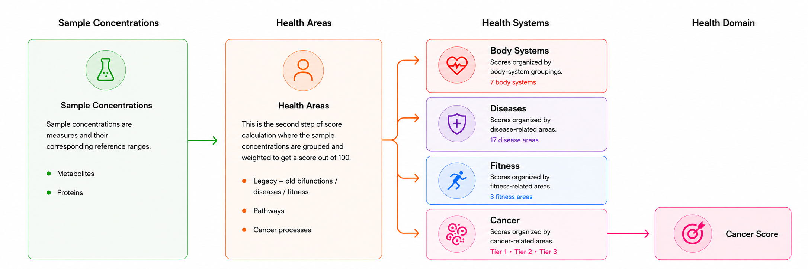

# Molecular You — Biomarker Scoring System


## Project Goal

Modify the calculation of Molecular You's current percentage-based health scores to fit the new system-level scores (implemented with the rollout of the PDF-first product).

This document describes how a raw biomarker measurement is turned into a score between 0 and 100, how those scores are rolled up into health area scores, and how health area scores are rolled up into the final health system scores.

---

## Important Links

- **Prototype:** https://windyzn.github.io/scoring-workbench/
- **Data for prototype:** https://drive.google.com/drive/folders/1gjlc_irj0skTBsm3zoVgEhvzQ2RlkpiX
- **Back-end data:** https://docs.google.com/spreadsheets/d/1_Cev13sOQZ7J_Hs5pzbmMJCtkgyOtz-6rQzBzf3Fhak/edit?gid=1155009125#gid=1155009125

---

## 1. Overview



The product uses a three-layer naming convention:

```
Biomarker score  →  Health area score  →  Health system score -> Domain score
```

- **Biomarkers** are individual lab measurements (e.g. Homocysteine concentration).
- **Health Areas** are categorical groupings of biomarkers to highlight body mechanisms. Each health area contains one or more biomarkers, may be the final score, or feed into one or more health systems. "Health Area" is an umbrella term — each product uses its own concrete name for this layer: general body-system and disease scoring calls it a **Pathway** (Sections 4-13), cancer scoring calls it a **Cancer Process** (Section 14).
- **Health Systems** are the grouping of different health areas. "Health System" is likewise an umbrella term: general body-system, disease, and fitness scoring calls it a **System**, while cancer scoring calls the equivalent grouping a **Tier** (Section 14).
- **Domain** is one step above Health Systems. Some health systems aggregate one layer further, into a single Domain Score.

Weights at the biomarker and process levels can be customised. The sections below explain exactly how each step works. See Section 16 for a full glossary mapping these umbrella terms to each product's concrete vocabulary.

The relationship between each step can be found here: https://docs.google.com/spreadsheets/d/1_Cev13sOQZ7J_Hs5pzbmMJCtkgyOtz-6rQzBzf3Fhak/edit?usp=sharing

---

## 2. Required Input Data

Each biomarker has three required fields in order to calculate all subsequent scores:

| Column | Description |
|--------|-------------|
| `concentration` | The measured lab concentration |
| `ref_low` | Lower bound of the reference range |
| `ref_high` | Upper bound of the reference range |

If a biomarker record is missing entirely (not present in the data), it is excluded from all calculations. It does not count as zero.

Certain concentration values are also excluded before scoring:

| Value | Meaning | Action |
|-------|---------|--------|
| `BLQ` | Below Limit of Quantification — concentration too low to measure reliably | Excluded |
| `NR` | Not Reported — result not reported by the lab | Excluded |
| `ND` | Not Detected — analyte not detected in the sample | Excluded |

These are treated identically to missing records — excluded from all weighted averages and not counted as zero.

---

## 3. Biomarker Colour Classification

Before scoring, each biomarker is assigned a colour and a direction.

### 3.1 Derived Boundaries

First, compute the range width:

```
range = ref_high - ref_low
```

Then compute four boundaries using the green margin parameter `green_pct` (default: `0.05`):

```
green_low  = ref_low  + green_pct × range
green_high = ref_high - green_pct × range

yellow_low  = ref_low  - green_pct × range
yellow_high = ref_high + green_pct × range
```

`green_pct` creates a small buffer inside the reference range that defines the "fully healthy" colour band, and a matching buffer outside that defines the "borderline" colour band.

### 3.2 Colour Assignment

```
if concentration >= green_low AND concentration <= green_high:
    colour = GREEN

else if concentration >= yellow_low AND concentration <= yellow_high:
    colour = YELLOW

else:
    colour = RED
```

### 3.3 Direction Assignment

```
if concentration > green_high:
    direction = HIGH

else if concentration < green_low:
    direction = LOW

else:
    direction = NORMAL
```

---

## 4. Biomarker Score

### 4.1 Green Zone — Score Is 100

If `colour = GREEN`, the biomarker scores `100`. No further calculation needed.

### 4.2 Impact Direction

Each biomarker–process association has an `impact_dir` field that specifies which direction of deviation from the green zone actually impacts the score.

| `impact_dir` | Behaviour |
|--------------|-----------|
| `"both"` (default) | Deviation in either direction reduces the score — both high and low are clinically relevant |
| `"high"` | Only being above `green_high` reference range value reduces the score. Being below `green_low` has no association — scores 100 |
| `"low"` | Only being below `green_low` reference range value reduces the score. Being above `green_high` has no association — scores 100 |

> **Example — Glucose:** High glucose is associated with the sugar metabolism process; low glucose has no clinical concern in this context. Setting `impact_dir = "high"` means a participant with glucose below the green reference range scores 100, assuming all other biomarkers are in-range (no impact), while high glucose is penalised normally.

This setting is per biomarker–process association and is controlled by the science team. It defaults to `"both"` if not specified.

### 4.3 Out-of-Range — Distance-Based Decay

If the biomarker colour is yellow or red and the concentration is on the penalised side (per `impact_dir`), calculate how far the concentration is outside the **green zone boundary**, expressed as a fraction of the **green range width**:

```
green_range = green_high - green_low

if direction = HIGH:
    distance = (concentration - green_high) / green_range

if direction = LOW:
    distance = (green_low - concentration) / green_range
```

> **Note:** Distance is measured from the green boundary (not the raw reference boundary) and normalised against the green range width. The green reference range is defined as 5% within the actual curated reference range on both ends. For example, a curated reference range of 0–100 would have a green reference range of 5–95, giving a `green_range` of 90.

Then normalise against the cutoff parameter (default: `0.5`). This is the distance at which the score reaches 0:

```
t = clamp(distance / cutoff, 0, 1)
```

`clamp(x, 0, 1)` means: if `x < 0` return `0`; if `x > 1` return `1`; otherwise return `x`.

### 4.4 Decay Curves

Apply one of two decay curves to `t` to get the score. The curve is controlled by the `curve` parameter (default: `"linear"`).

**Linear:**
```
score = 100 × (1 - t)
```

**Log2** (faster initial drop, gentler tail — score falls more quickly for mild deviations then flattens toward zero):
```
score = max(0, 100 × (1 - log2(1 + t)))
```

The decay curve will be decided by the science team. In all cases, clamp the final score to `[0, 100]`.

### 4.5 Pseudocode for Biomarker Scoring

```
function biomarker_score(concentration, ref_low, ref_high, green_pct, cutoff, curve, impact_dir):

    range = ref_high - ref_low
    if range <= 0:
        return NULL

    green_low   = ref_low  + green_pct × range
    green_high  = ref_high - green_pct × range
    green_range = green_high - green_low

    if concentration >= green_low AND concentration <= green_high:
        return 100

    if impact_dir = "high" AND concentration < green_low:
        return 100    # only high impacts — being low has no association

    if impact_dir = "low" AND concentration > green_high:
        return 100    # only low impacts — being high has no association

    if concentration > green_high:
        distance = (concentration - green_high) / green_range
    else:
        distance = (green_low - concentration) / green_range

    t = clamp(distance / cutoff, 0, 1)

    if curve = "linear":
        score = 100 × (1 - t)
    else if curve = "log2":
        score = max(0, 100 × (1 - log2(1 + t)))

    return clamp(score, 0, 100)
```

---

## 5. Effective Biomarker Weight

Each biomarker has an effective weight used when averaging into its process score. This weight comes from one of two sources:

- a manual biomarker weight set by the science team, if the biomarker is clinically important, or
- a global colour multiplier otherwise

### 5.1 Global Colour Multipliers

The scoring algorithm uses a weighted-risk model, where out-of-range biomarkers are assigned higher weights by default to ensure significant clinical deviations are immediately apparent. These apply by default to all biomarkers based on their colour:

| Biomarker colour | Multiplier parameter | Default value |
|-----------------|---------------------|---------------|
| green | always 1.0, not configurable | 1.0 |
| yellow | `yellow_weight` | 2.0 |
| red | `red_weight` | 4.0 |

The default values carry forward from the previous percentage-based scoring system, but should be flexible for any future adjustments.

### 5.2 Manual Biomarker Weight

The science team can assign a manual weight override to any biomarker that is more clinically relevant. The manual weight entry has four fields:

| Field | Allowed values | Default | Description |
|-------|---------------|---------|-------------|
| `bio_weight` | Integer 1–10 | `1` | The weight value itself |
| `bio_color` | `"red"`, `"yellow"`, `"both"` | `"red"` | Which biomarker colour must be active for this weight to apply |
| `bio_level` | `"high"`, `"low"`, `"both"` | `"high"` | Which direction must be active for this weight to apply |
| `impact_dir` | `"both"`, `"high"`, `"low"` | `"both"` | Which direction of deviation from the green zone impacts the score — deviations in the non-impacting direction score 100 with no decay (see Section 4.2) |

> **Note:** `impact_dir` is a property of the biomarker–process association, not of the weight override condition. It applies regardless of whether a manual weight is set.

The manual weight only replaces the global multiplier when both conditions are met:

```
color_match = (bio_color = "both")
           OR (bio_color = "red"    AND colour = RED)
           OR (bio_color = "yellow" AND colour = YELLOW)

level_match = (bio_level = "both")
           OR (bio_level = "high" AND direction = HIGH)
           OR (bio_level = "low"  AND direction = LOW)

if no explicit entry for this biomarker:
    effective_weight = colour multiplier   # yellow_weight, red_weight, or 1.0
else if color_match AND level_match:
    effective_weight = bio_weight          # replaces colour multiplier
else:
    effective_weight = colour multiplier   # conditions not met
```

> **Note:** The manual weight and the colour multiplier do not stack. The manual weight fully replaces the colour multiplier when its conditions are met; otherwise the colour multiplier is used as-is.

---

## 6. Process Score

A process score is the weighted average of its biomarker scores, using each biomarker's effective weight. Only biomarkers with data are included — missing biomarkers are skipped entirely (not treated as 0).

```
function process_score(biomarkers):

    total_weight = 0
    weighted_sum = 0

    for each biomarker in biomarkers:
        if biomarker is missing:
            skip

        score = biomarker_score(...)
        eff_w = effective_biomarker_weight(...)

        weighted_sum += score × eff_w
        total_weight += eff_w

    if total_weight = 0:
        return NULL    # no data for this process

    return weighted_sum / total_weight
```

A process with no data returns NULL and is excluded from the health system score.

---

## 7. Effective Process Weight

Each process has a weight that controls its influence on the overall system score. Like biomarker weights, the manual weight only applies when an explicit entry exists and the process score falls in the matching colour zone — otherwise the weight falls back to 1.

Unlike biomarker weights, process weights do not have a `level` condition.

| Field | Allowed values | Meaning |
|-------|---------------|---------|
| `proc_weight` | Integer 1–10 | The weight value itself |
| `proc_color` | `"red"`, `"yellow"`, `"both"` | Which zone the process score must be in for this weight to apply |

### 7.1 Process Zone Classification

Process scores are mapped to colour zones using thresholds set by the science team:

| Process score | Zone |
|---------------|------|
| ≥ 91 | GREEN |
| 70 – 90 | YELLOW |
| 0 – 69 | RED |

### 7.2 Applying the Condition

```
proc_zone = process_zone(process_score)

color_match = (proc_color = "both")
           OR (proc_color = "red"    AND proc_zone = RED)
           OR (proc_color = "yellow" AND proc_zone = YELLOW)
           OR (proc_color = "green"  AND proc_zone = GREEN)

if no explicit entry for this process:
    effective_process_weight = 1
else if color_match:
    effective_process_weight = proc_weight
else:
    effective_process_weight = 1    # colour condition not met
```

Same logic as biomarkers: the override only applies when an entry has been explicitly set. Absence of an entry always falls back to a weight of 1.

---

## 8. System Score

A system score is the weighted average of its process scores, using each process's weight. Only processes with a non-null score are included.

```
function system_score(processes):

    total_weight = 0
    weighted_sum = 0

    for each process in processes:
        if process score is NULL:
            skip

        eff_pw = effective_process_weight(process_score, proc_weight, proc_color)

        weighted_sum += process_score × eff_pw
        total_weight += eff_pw

    if total_weight = 0:
        return NULL

    return weighted_sum / total_weight
```

---

## 9. Default Parameter Values

These are the defaults used in the current implementation. They are all adjustable and should be saved in the database.

| Parameter | Default | Description | Example |
|-----------|---------|-------------|---------|
| `green_pct` | `0.05` | Size of the buffer for the "yellow" biomarkers as a fraction of the reference range | 5% means "yellow" straddles 5% on either side of the true reference range |
| `cutoff` | `0.5` | Distance from the green boundary (as a fraction of the green range width) at which the score reaches 0 | 50% means any concentration more than 50% of the green range width beyond the green boundary scores 0 |
| `curve` | `"linear"` | Decay curve shape: `"linear"` or `"log2"` | |
| `yellow_weight` | `2.0` | Multiplier applied to yellow biomarkers by default | |
| `red_weight` | `4.0` | Multiplier applied to red biomarkers by default | |
| `bio_weight` | `1` | The weight (importance) applied to a biomarker-process relationship. Can be any value 1–10. | |
| `bio_color` | `"red"` | The colour of the biomarker needed for the manual weight to apply | If `bio_color = "red"`, the `bio_weight` override only activates when biomarker colour is red |
| `bio_level` | `"high"` | The direction of the biomarker needed for the manual weight to apply | If `bio_level = "high"`, the `bio_weight` override only activates when biomarker direction is high |
| `impact_dir` | `"both"` | Which direction of deviation impacts the score — deviations in the non-impacting direction score 100 | If `impact_dir = "high"`, only being high reduces the score; being low scores 100 |
| `proc_weight` | `1` | The weight (importance) applied to a process-system relationship. Can be any value 1–10. | |
| `proc_color` | `"red"` | The colour of the process needed for the manual weight to apply | If `proc_color = "red"`, the `proc_weight` override only activates when process colour is red |

---

## 10. Score Colour Cut-offs

After a health area and/or health system score is computed, it is assigned a colour zone — green, yellow, or red — based on where it falls relative to two thresholds. This colour is used to communicate health status at a glance.

All health areas share a single set of cut-offs — the same boundaries apply uniformly across every process in every health system. Similarly, all health systems share a single set of cut-offs. Cancer scoring uses a separate set of cut-offs (Section 14.4).

Health areas and health system cut-offs are independent of each other. A score of 75 may be yellow at the process level and green at the system level if the two sets of thresholds differ.

### 10.1 What the Cut-offs Mean

| Colour | Meaning |
|--------|---------|
| Green | Score is at or above the healthy threshold — the process or system is performing well |
| Yellow | Score is below the green threshold but above the concern threshold — borderline, warrants attention |
| Red | Score is below the concern threshold — the process or system should be prioritised for review |

### 10.2 Current Default Values

| Level | Green | Yellow | Red |
|-------|-------|--------|-----|
| Health Area | ≥ 91 | 70 – 90 | 0 – 69 |
| Health System | ≥ 91 | 70 – 90 | 0 – 69 |

> **Note for implementers:** These thresholds are based on the previous percentage scoring system and are expected to be refined as more client data is collected and reviewed by the science team. Do not hardcode these values — they should be configurable parameters in any downstream implementation.

---

## 11. Worked Example

This example walks through the full calculation for a single biomarker, up to its contribution to a health system score.

### Setup

| Variable | Value |
|----------|-------|
| Biomarker | Homocysteine |
| `concentration` | 18.0 |
| `ref_low` | 5.0 |
| `ref_high` | 15.0 |
| `green_pct` | 0.05 (default) |
| `cutoff` | 0.5 (default) |
| `curve` | `"linear"` (default) |
| `yellow_weight` | 2.0 (default) |
| `red_weight` | 4.0 (default) |
| `bio_weight` | 5 (manually set by scientist) |
| `bio_color` | `"red"` |
| `bio_level` | `"high"` |

### Step 1 — Zone Classification

```
range      = 15.0 - 5.0 = 10.0

green_low  = 5.0  + 0.05 × 10.0 = 5.5
green_high = 15.0 - 0.05 × 10.0 = 14.5

yellow_low  = 5.0  - 0.05 × 10.0 = 4.5
yellow_high = 15.0 + 0.05 × 10.0 = 15.5
```

`concentration = 18.0`, which is above `yellow_high (15.5)`, so:

```
colour    = RED
direction = HIGH
```

### Step 2 — Biomarker Score

```
green_range = 14.5 - 5.5 = 9.0

distance = (18.0 - 14.5) / 9.0 = 3.5 / 9.0 ≈ 0.389

t = clamp(0.389 / 0.5, 0, 1) = clamp(0.778, 0, 1) = 0.778

score = 100 × (1 - 0.778) = 22.2
```

### Step 3 — Effective Biomarker Weight

```
color_match = (bio_color = "red" AND colour = RED)      → TRUE
level_match = (bio_level = "high" AND direction = HIGH) → TRUE

→ effective_weight = 5   (manual override applies)
```

If the conditions had not matched, or if no explicit entry existed, the effective weight would have been `red_weight = 4.0`.

### Step 4 — Process Score

Assume this process has two biomarkers:

| Biomarker | Score | Effective weight | Notes |
|-----------|-------|-----------------|-------|
| Homocysteine | 22.2 | 5 | manual override |
| Methylmalonic acid | 85.0 | 2.0 | yellow colour, no override |

```
weighted_sum  = (22.2 × 5) + (85.0 × 2) = 111.0 + 170.0 = 281.0
total_weight  = 5 + 2 = 7

health_area_score = 281.0 / 7 ≈ 40.1
```

Health area score: **40.1** — RED zone (< 70).

### Step 5 — Effective Process Weight

Assume this process has a manual `proc_weight` of 3, with `proc_color = "red"`:

```
proc_zone = RED   # process_score = 40.1 < 70

color_match = (proc_color = "red" AND proc_zone = RED)  → TRUE

→ effective_process_weight = 3   (manual override applies)
```

### Step 6 — System Score

Assume the system has two processes:

| Process | Score | Effective process weight | Notes |
|---------|-------|------------------------|-------|
| Methylation | 40.1 | 3 | manual override, RED zone |
| Oxidative Stress | 72.0 | 1 | no explicit entry, falls back to 1 |

```
weighted_sum  = (40.1 × 3) + (72.0 × 1) = 120.3 + 72.0 = 192.3
total_weight  = 3 + 1 = 4

system_score  = 192.3 / 4 = 48.1
```

Health system score: **48.1** — RED zone (< 70).

---

## 12. Variable Hierarchy Depth

The scoring model is designed around a four-level hierarchy (biomarker → process → system → domain), but this is not fixed. Different products may use different depths.

The model should be collapsable or expandable. Each level uses the same logic: collect scores from the level below, apply weights and zone multipliers, return a weighted average. Only the labels change.

---

## 13. Domain Score

An domain score can be derived by taking the simple average of all system scores. (Some products use fewer levels — see Section 12 — in which case this average is taken over whatever the final level's scores are.).

```
domain_score = mean(score_1, score_2, ..., score_n)
```

Where `score_i` are all non-NULL scores at the final level. NULL scores are excluded from the average.

This is intentionally unweighted — each system contributes equally. If differential weighting across systems is needed in the future, the same `effective_process_weight` logic from section 7 can be applied at the system level.

---

## 14. Cancer Scoring

The cancer product uses a 4-tier approach computed using the standard biomarker → health area → health systems → domain logic. The final domain score for cancer is called **Cancer Score**. Each score maps to a three-category risk classification (Green / Yellow / Red).

Full pipeline:

```
Biomarker score  →  Cancer process score  →  Cancer tier score  → Cancer score (overall cancer classification)
```

A score of 100 represents all biomarkers within normal reference ranges, and 0 represents maximum deviation. Lower scores indicate higher cancer risk.

---

### 14.1 Cancer Tiers

Cancer Processes are organised into three tiers of increasing cancer specificity.

**Tier 1 — Systemic Risk Environment**

Non-cancer-specific foundational conditions that create a permissive biological environment for tumour initiation. Abnormalities here are upstream risk amplifiers, not direct indicators of malignancy.

| Cancer Process | Biomarkers | Cancer Specificity |
|---------|------------|-------------------|
| Metabolic Dysfunction | 17 | Low |
| Thromboinflammation | 17 | Low |
| Oxidative Stress | 6 | Low |

**Tier 2 — Transitional Biology**

A collection of middle-ground cancer processes representing necessary steps in cancer progression that can also occur in non-malignant contexts (e.g. tissue repair, chronic infection). Their cancer relevance increases substantially when Tier 1 signals are also present.

| Cancer Process | Biomarkers | Cancer Specificity |
|---------|------------|-------------------|
| Cell Proliferation | 11 | Moderate |
| Immune System Evasion | 16 | Moderate |

**Tier 3 — Tumour-Associated Biology**

The highest specificity for processes directly associated with established tumour biology. Elevations here, particularly when accompanied by Tier 1 and Tier 2 abnormalities, warrant careful clinical correlation.

| Cancer Process | Biomarkers | Cancer Specificity |
|---------|------------|-------------------|
| Angiogenesis | 6 | High |
| Matrix Remodelling | 8 | High |
| Metastasis | 15 | High |

---

### 14.2 Step 1 — Cancer Tier Score

Within each Tier, compute the arithmetic mean of all Cancer Process scores:

```
T1 = mean(cancer process scores in Tier 1)
T2 = mean(cancer process scores in Tier 2)
T3 = mean(cancer process scores in Tier 3)
```

A Cancer Process with a NULL score (no data) is excluded from the Tier mean. If all Cancer Processes in a Tier are NULL, the Tier average is NULL and that Tier is excluded from the Cancer Score calculation.

---

### 14.3 Step 2 — Weighted Cancer Score

The three tier averages are combined using weights that reflect each tier's cancer specificity. Tier 3 receives three times the weight of Tier 1; Tier 2 receives twice the weight of Tier 1:

```
Cancer Score = ( weight_t1 × T1  +  weight_t2 × T2  +  weight_t3 × T3 ) / sum of weights
```

```
Cancer Score = ( 1 × T1  +  2 × T2  +  3 × T3 ) / 6
```

| Tier | Weight | Rationale |
|------|--------|-----------|
| Tier 1 | 1 | Non-specific systemic risk |
| Tier 2 | 2 | Transitional cancer biology |
| Tier 3 | 3 | Direct tumour-associated biology |

The Cancer Score is on a 0–100 scale. 100 represents perfect health across all Cancer Processes; 0 represents maximum deviation with full Tier 3 weighting.

---

### 14.4 Risk Classification

The Cancer Score maps to three risk categories — the same Green/Yellow/Red convention used for Cancer Process and system scores elsewhere in the app, but with cancer-specific cut-offs rather than the standard 91/70/69 scale:

| Score Range | Classification | Interpretation | Clinical Action Protocol |
|-------------|---------------|-----------------|---------------------------|
| 85 – 100 | **Green** — Low / No Alteration | Cancer Processes within expected reference ranges | No immediate clinical recommendations; standard routine checkups. |
| 80 – 84 | **Yellow** — Moderately Altered Cancer Processes | Intermediate risk / low-level biological shift | Retest in 6 months to monitor trajectory. |
| 70 – 79 | **Yellow** — Moderately Altered Cancer Processes | Intermediate risk / low-level biological shift | Retest in 3 months to evaluate score velocity. |
| 0 – 69 | **Red** — Significantly Altered Cancer Processes | High risk; significant alignment with tumour-associated biology | Advise client to seek primary care physician/specialist follow-up for formal diagnostic investigation. |

> **Note:** The Yellow band (70–84) has a single colour and label but two retest cadences depending on where the score falls within it — 80–84 retests at 6 months, 70–79 retests at 3 months.

> **Note for implementers:** These cut-offs are specific to the Cancer Score and are separate from the general 91/70/69 Green/Yellow/Red scale used for individual Cancer Process and system scores (section 10). Do not conflate the two — a Cancer Process tile showing "Yellow" at 80 and the overall Cancer Score showing "Green" at 85 are both correct simultaneously, because each uses its own scale.

---

### 14.5 Clinical Override Protocol

The algorithmic classification is a reproducible first-pass result. A reviewing scientist or clinician may adjust the final classification by a maximum of **one category** in either direction when the biomarker narrative supports a different interpretation than the raw scores suggest.

Overrides must be documented with:

- The algorithmic classification and Cancer Score
- The adjusted classification
- The biological rationale for adjustment (e.g., "complement activation pattern consistent with autoimmune rather than malignant aetiology")
- Reviewer name and date

Adjustments of **more than one category** require secondary review and sign-off by the Chief Science Officer or Medical Director.

---

### 14.6 Worked Example for Cancer Scoring

**Raw Cancer Process scores:**

| Tier | Cancer Process | Score |
|------|---------|-------------|
| 1 | Metabolic Dysfunction | 66 |
| 1 | Thromboinflammation | 100 |
| 1 | Oxidative Stress | 100 |
| 2 | Cell Proliferation | 38 |
| 2 | Immune System Evasion | 54 |
| 3 | Angiogenesis | 38 |
| 3 | Matrix Remodelling | 50 |
| 3 | Metastasis | 58 |

**Tier averages:**

```
T1 = (66 + 100 + 100) / 3 = 88.7
T2 = (38 + 54) / 2        = 46.0
T3 = (38 + 50 + 58) / 3   = 48.7
```

**Weighted Cancer Score:**

```
Cancer Score = (1 × 88.7  +  2 × 46.0  +  3 × 48.7) / 6
             = (88.7 + 92.0 + 146.1) / 6
             = 326.8 / 6
             = 54.5
```

**Classification:** Score 54.5 → **Red** (0–69) — Advise client to seek primary care physician/specialist follow-up for formal diagnostic investigation.

---

## 15. Edge Cases to Handle

| Situation | Behaviour |
|-----------|-----------|
| `ref_high = ref_low` (zero-width range) | Return score of NULL — cannot compute a meaningful distance; treated the same as a missing biomarker |
| Biomarker not present in data | Exclude from all scores — do not treat as 0 |
| Concentration value is BLQ, NR, or ND | Exclude from all scores — do not treat as 0 |
| All biomarkers in a process are missing | Process score is NULL |
| All processes in a system are NULL | System score is NULL |
| Manual `bio_weight = 1` with conditions matching | Effective weight = 1 — the explicit 1× overrides the colour multiplier |

---

## 16. Terminology / Glossary

This document defines a small set of abstract "umbrella" terms for the scoring hierarchy in the general case (Section 1). Each product then uses its own concrete vocabulary for the same layers — the table below maps umbrella terms to their concrete, product-specific names.

| Umbrella term | Definition | General/Legacy products | Cancer product |
|---|---|---|---|
| Biomarker | An individual lab measurement (e.g. Homocysteine concentration). | Biomarker | Biomarker |
| Health Area | A categorical grouping of biomarkers representing a body mechanism; the layer between Biomarker and Health System. | Process (Sections 4-13) | Cancer Process (Section 14) |
| Health System | A grouping of Health Areas; the top-level score for most products. | System (body system / disease / fitness) | Tier (Tier 1 / 2 / 3, Section 14) |
| Domain | The final weighted aggregate score, mapped to a Green/Yellow/Red classification. | Overall Score (Section 13) | Cancer Score (Section 14) |

**Legacy products:** the pre-system reports shown in the architecture diagram (old biofunction / disease / fitness reports) are a part of the Health Area umbrella. They predate the current scoring model and aren't otherwise described in this document.